# Car Recommendation System - Architecture Documentation

## System Architecture Overview

## Database Schema Architecture

## ETL Data Pipeline

## Technology Stack

## API Architecture

## Data Flow Architecture

```mermaid
flowchart TB
    subgraph "Layer 1: Data Ingestion"
        CRAWL["Web Crawlers<br/>(Past data)"]
        CSV["CSV Export<br/>7 files"]
        CRAWL --> CSV
    end
    
    subgraph "Layer 2: Raw Data (Bronze)"
        RAW_TABLES["RAW Schema<br/>- used_vehicles<br/>- new_vehicles<br/>- sellers<br/>- reviews_ratings<br/>- vehicle_features<br/>- vehicle_images<br/>- relationships"]
        CSV -->|load_complete_database.py| RAW_TABLES
    end
    
    subgraph "Layer 3: Cleaned Data (Silver)"
        SILVER_TABLES["SILVER Schema<br/>- cleaned_vehicles<br/>- normalized_data<br/>- deduplicated"]
        RAW_TABLES -->|ETL Pipeline| SILVER_TABLES
    end
    
    subgraph "Layer 4: Business Data (Gold)"
        GOLD_TABLES["GOLD Schema<br/>- users<br/>- vehicles_with_ratings<br/>- popular_vehicles<br/>- user_favorites<br/>- user_interactions<br/>- user_searches"]
        SILVER_TABLES -->|Aggregation & Views| GOLD_TABLES
    end
    
    subgraph "Layer 5: Search & Vector"
        ES_DATA["Elasticsearch<br/>Indexed vehicles<br/>Full-text search"]
        VECTOR_DATA["Qdrant<br/>Vehicle embeddings<br/>Semantic search"]
        GOLD_TABLES -->|Index| ES_DATA
        GOLD_TABLES -->|Embedding| VECTOR_DATA
    end
    
    subgraph "Layer 6: Application Services"
        API_LAYER["FastAPI Backend<br/>- Authentication<br/>- Search<br/>- Recommendations<br/>- Feedback"]
        GOLD_TABLES --> API_LAYER
        ES_DATA --> API_LAYER
        VECTOR_DATA --> API_LAYER
    end
    
    subgraph "Layer 7: Presentation"
        UI_LAYER["Next.js Frontend<br/>- Homepage<br/>- Search<br/>- Vehicle Details<br/>- Recommendations<br/>- Favorites<br/>- Compare"]
        API_LAYER --> UI_LAYER
    end
    
    USER["👤 End User"]
    UI_LAYER --> USER
    
    style RAW_TABLES fill:#ffeaa7
    style SILVER_TABLES fill:#dfe6e9
    style GOLD_TABLES fill:#74b9ff
    style ES_DATA fill:#fd79a8
    style VECTOR_DATA fill:#a29bfe
    style API_LAYER fill:#55efc4
    style UI_LAYER fill:#81ecec
```

## Authentication Flow

```mermaid
sequenceDiagram
    actor User
    participant FE as Frontend
    participant API as Backend API
    participant DB as PostgreSQL<br/>(gold.users)
    participant JWT as JWT Service
    
    rect rgb(200, 220, 240)
        note right of User: Registration Flow
        User->>FE: Fill registration form<br/>(username, email, password)
        FE->>API: POST /api/v1/auth/register
        API->>API: Validate input<br/>(Pydantic)
        API->>API: Hash password<br/>(bcrypt)
        API->>DB: INSERT INTO gold.users
        DB-->>API: User created (UUID)
        API->>JWT: Generate access token<br/>(HS256, 30min)
        JWT-->>API: JWT token
        API-->>FE: {token, user_info}
        FE->>FE: Store in Zustand<br/>+ localStorage
        FE-->>User: Redirect to homepage
    end
    
    rect rgb(220, 240, 200)
        note right of User: Login Flow
        User->>FE: Enter username/email<br/>+ password
        FE->>API: POST /api/v1/auth/login
        API->>DB: SELECT FROM gold.users<br/>WHERE username OR email
        DB-->>API: User record
        API->>API: Verify password<br/>(bcrypt.verify)
        alt Password correct
            API->>JWT: Generate access token
            JWT-->>API: JWT token
            API-->>FE: {token, user_info}
            FE->>FE: Store token
            FE-->>User: Login success
        else Password incorrect
            API-->>FE: 401 Unauthorized
            FE-->>User: Show error
        end
    end
    
    rect rgb(240, 220, 200)
        note right of User: Protected Request Flow
        User->>FE: Add to favorites
        FE->>API: POST /api/v1/feedback/favorite<br/>Header: Authorization: Bearer {token}
        API->>JWT: Verify token
        alt Token valid
            JWT-->>API: User ID extracted
            API->>DB: INSERT INTO gold.user_favorites
            DB-->>API: Success
            API-->>FE: 200 OK
            FE-->>User: ❤️ Added to favorites
        else Token invalid/expired
            API-->>FE: 401 Unauthorized
            FE->>FE: Clear auth state
            FE-->>User: Redirect to login
        end
    end
```

## Deployment Architecture

```mermaid
flowchart TB
    subgraph "Docker Network: car-recsys-network"
        subgraph "Infrastructure Services"
            PG["PostgreSQL:5432<br/>postgres:15-alpine<br/>Volume: postgres_data"]
            ES["Elasticsearch:9200<br/>elasticsearch:8.11.0<br/>Volume: elasticsearch_data"]
            QD["Qdrant:6333<br/>qdrant:latest<br/>Volume: qdrant_data"]
            RD["Redis:6379<br/>redis:7-alpine<br/>Volume: redis_data"]
        end
        
        subgraph "Database Tools"
            PR["PostgREST:3001<br/>postgrest:latest"]
            BB["Bytebase:8080<br/>bytebase:latest<br/>Volume: bytebase_data"]
        end
        
        subgraph "Application Services"
            BE["Backend:8000<br/>Python 3.11<br/>FastAPI + Uvicorn<br/>Mount: ./backend"]
            ETL["ETL Worker<br/>Python 3.11<br/>Mount: ./etl"]
        end
        
        subgraph "Frontend"
            FE["Frontend:3000<br/>Node.js 20<br/>Next.js 14<br/>Mount: ./frontend"]
        end
    end
    
    PG --> PR
    PG --> BB
    PG --> BE
    PG --> ETL
    
    ES --> BE
    QD --> BE
    RD --> BE
    
    BE --> FE
    
    INTERNET["🌐 Internet"]
    INTERNET -->|localhost:3000| FE
    INTERNET -->|localhost:8000| BE
    INTERNET -->|localhost:8080| BB
    INTERNET -->|localhost:3001| PR
    
    style PG fill:#4fc3f7
    style ES fill:#f48fb1
    style QD fill:#ce93d8
    style RD fill:#ef5350
    style BE fill:#66bb6a
    style FE fill:#42a5f5
    style ETL fill:#ffb74d
```

## Key Components & Frameworks

### Frontend Stack
- **Framework**: Next.js 14 (App Router, Server Components)
- **Language**: TypeScript 5
- **Styling**: Tailwind CSS 3
- **State**: Zustand with persist middleware
- **Forms**: React Hook Form
- **HTTP**: Axios
- **Build**: Webpack (Next.js default)

### Backend Stack
- **Framework**: FastAPI 0.104+
- **Language**: Python 3.11
- **Server**: Uvicorn (ASGI)
- **ORM**: SQLAlchemy 2.0
- **Validation**: Pydantic v2
- **Auth**: JWT (python-jose, HS256)
- **Password**: bcrypt

### Database & Storage
- **RDBMS**: PostgreSQL 15
- **Search**: Elasticsearch 8.11
- **Vector**: Qdrant latest
- **Cache**: Redis 7
- **REST API**: PostgREST
- **IDE**: Bytebase

### ML & Search
- **Embeddings**: sentence-transformers
- **Models**: BERT-based models
- **Search**: Elasticsearch full-text
- **Vector Search**: Qdrant similarity

### DevOps
- **Container**: Docker + Docker Compose
- **Network**: Bridge network
- **Volumes**: Persistent data storage
- **Scripts**: Bash automation (run.sh, setup.sh)

## Data Statistics

- **Total Vehicles**: 5,508
- **Total Images**: 259,124 (avg 28.75 per vehicle)
- **Vehicles with Images**: 5,500 (99.85%)
- **Database Size**: ~720K rows across all tables
- **Schemas**: 3 (RAW, SILVER, GOLD)
- **Tables**: 13+ tables
- **Views**: 2 (vehicles_with_ratings, popular_vehicles)

## Performance Features

- **Caching**: Redis with 5-minute TTL
- **Indexing**: PostgreSQL B-tree indexes on search fields
- **Vector Search**: Qdrant HNSW index
- **Full-text**: Elasticsearch inverted index
- **Image Loading**: Lazy loading, progressive images
- **API**: Async FastAPI endpoints
- **Connection Pooling**: SQLAlchemy pool

## Security Features

- **Authentication**: JWT tokens (HS256)
- **Password Hashing**: bcrypt
- **CORS**: Configured for localhost
- **SQL Injection**: Prevented by SQLAlchemy ORM
- **XSS**: React automatic escaping
- **Rate Limiting**: Redis-based (planned)

---

**Last Updated**: December 20, 2025
**Version**: 1.0.0
**Maintainer**: Car Recommendation System Team
